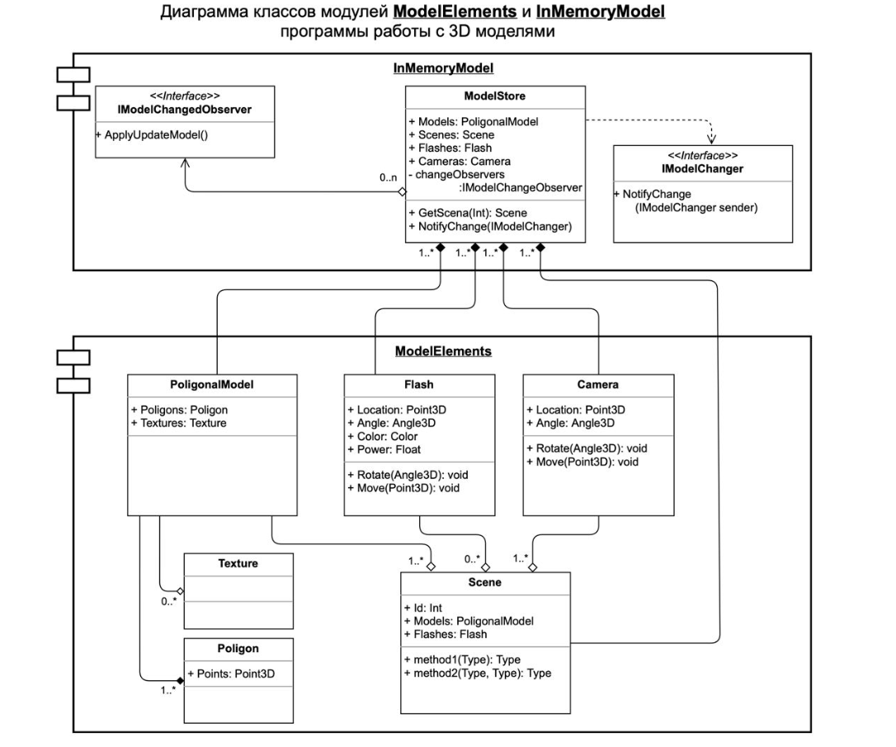

# Архитектура ПО (семинары)

## Урок1. Введение в понятие архитектуры, проектирование ПО и жизненный цикл програмного продукта. UML-диаграммы.

**<u>Задание:</u>** На основе диаграммы классов ModelElements разработать классы: ModelStore, PoligonalModel (Texture, Poligon), Flash, Camera, Scene.

