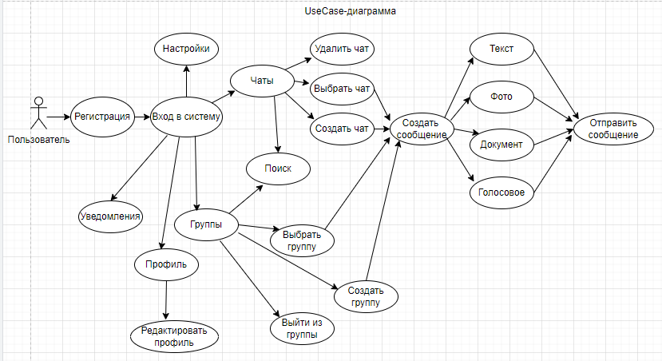
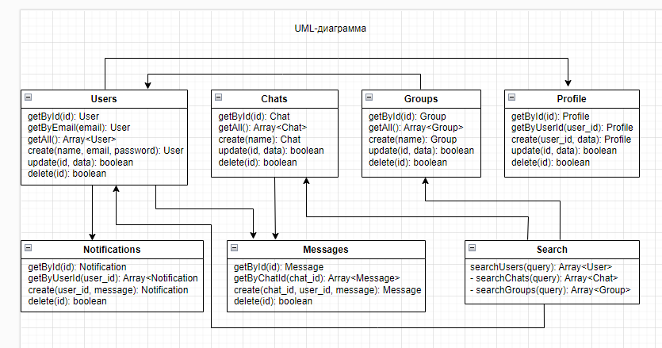
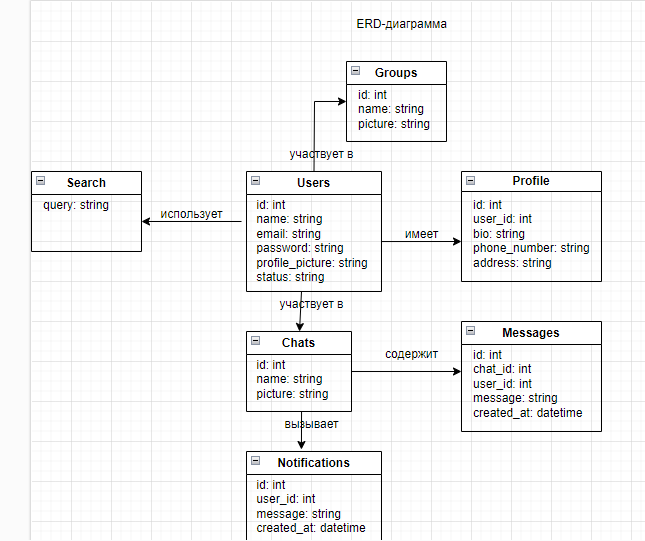
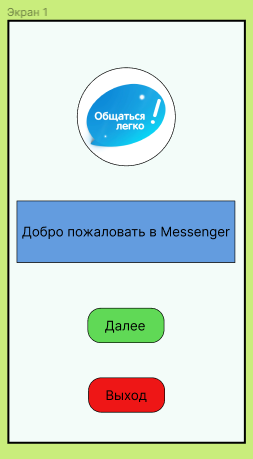
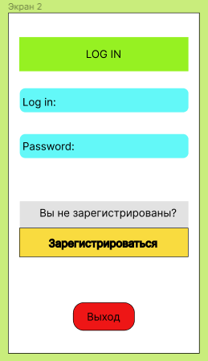
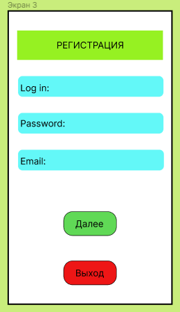
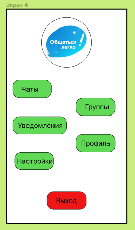

# Архитектура ПО (семинары)
## Урок 10. Структура приложения с пользовательским интерфейсом и базой данных (паттерн Repository)
Разработать приложение мессенджера (на выбор desktop/web/mobile).  
Требуется написать use case диаграмму, выбрать архитектуру для приложения (кратко обосновать выбор), UML и ER диаграммы для выбранной архитектуры.  
Используя метод персон (не менее 3), описать каких функций не хватает. Пересмотреть UML и ER диаграммы с учетом недостатков.  
Создать интерфейс в figma для приложения.

Инструменты: 
https://www.figma.com/  
https://app.diagrams.net/  
https://www.dbdesigner.net/  
https://swagger.io  

 
 
 

Для реализации приложения выбрана архитектура MVC, так как данное приложение учебное,
разрабатывается не в полном объеме, поэтому нагрузка на код контроллера минимальная.

Первые 4 экрана интерфейса приложения: 

 

 

 

 