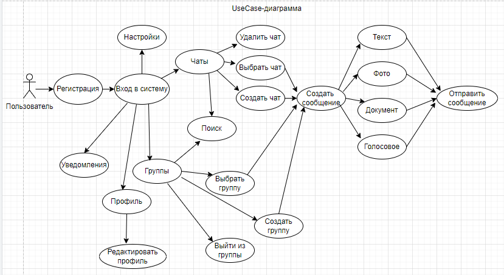
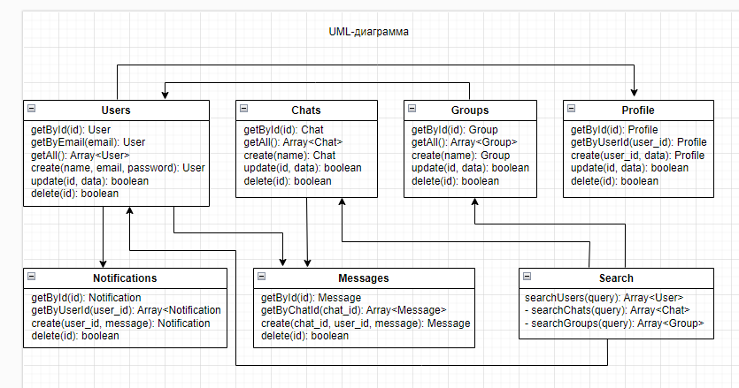
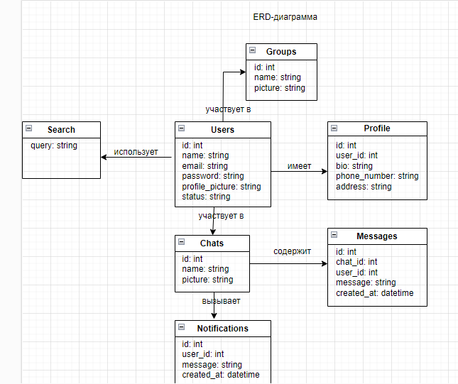
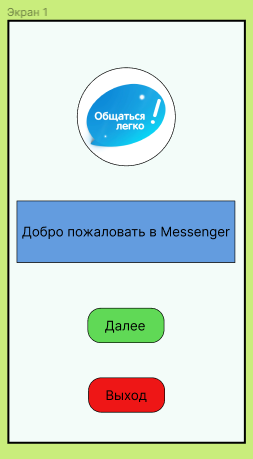
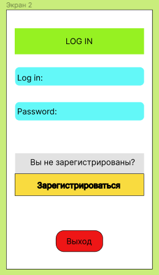
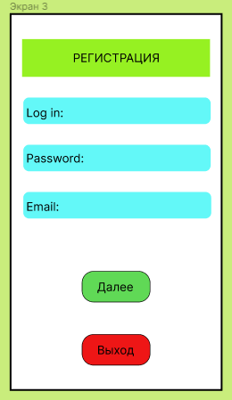
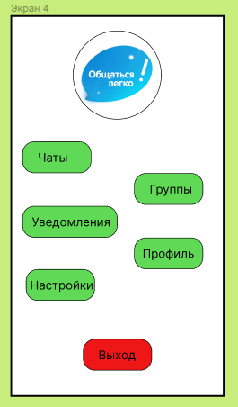
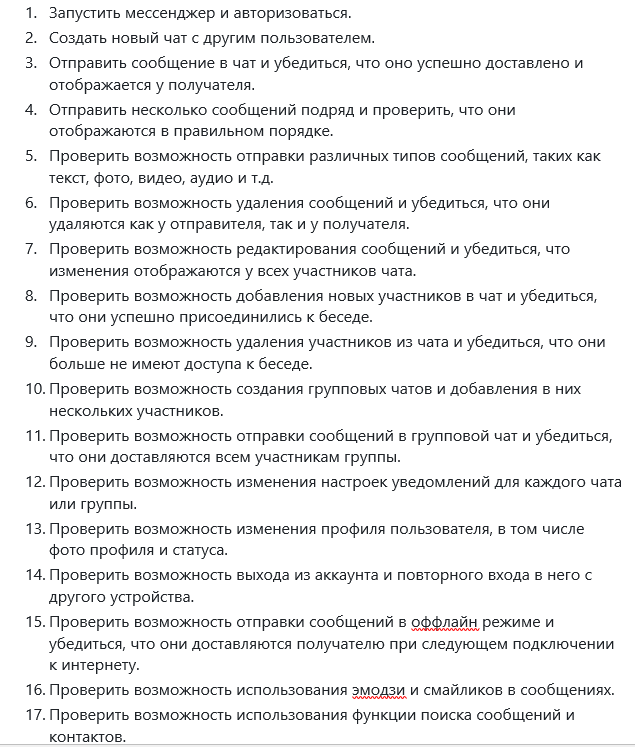
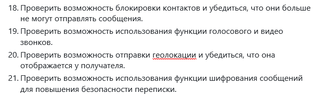
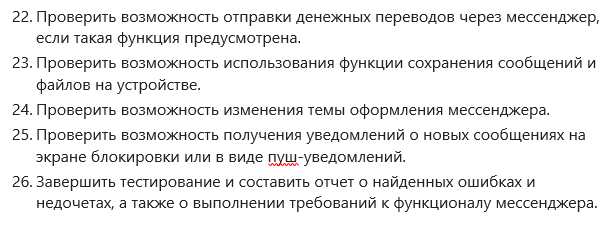

## Архитектура ПО (семинары)

# Урок 12. Принципы тестирования приложений
**<u>Задание:</u>** Сделать ревью всех пунктов последних трех семинаров

1. Разработана структура мобильного приложения для отправки сообщений с пользовательским интерфейсом.

Инструменты: 
https://www.figma.com/  

 
 
 

Для реализации приложения выбрана архитектура MVC, так как данное приложение учебное,
разрабатывается не в полном объеме, поэтому нагрузка на код контроллера минимальная.
В идеале желательно использовать MVP или MVVM-архитектуры.

Первые 4 экрана интерфейса приложения: 

 

 

 

 

2. Начато создание интерфейса мобильного приложения для отправки сообщений "Messenger"  
с использованием интегрированоой среды разработки Android Studio (см.Seminar_11).

3. Разработан сценарий UAT-тестирования создаваемого мобильного приложения.
Это поможет определитьс тепень удобства, простоты и интуитивности интерфейса, 
а также степень удовлетворенности пользователя.

   

   

   

