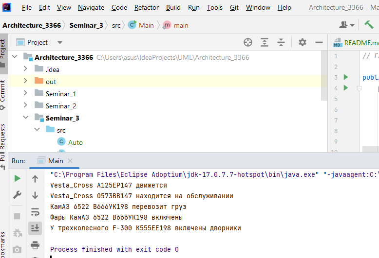

## Архитектура ПО (семинары)

## Урок 3. Принципы SOLID

1. Спроектировать абстрактный класс «Car» у которого должны быть свойства: марка, модель, цвет, тип кузова, число колёс, тип топлива, тип коробки передач, объём двигателя; методы: движение, обслуживание, переключение передач, включение фар, включение дворников.
2. Создать конкретный автомобиль путём наследования класса «Car».
3. Расширить абстрактный класс «Car», добавить метод: подметать улицу. 
4. Создать конкретный автомобиль путём наследования класса «Car». Провести проверку принципа SRP.
5. Расширить абстрактный класс «Car», добавить метод: включение противотуманных фар, перевозка груза. Провести проверку принципа OCP.
6. Создать конкретный автомобиль путём наследования класса «Car», определить число колёс = 3. Провести проверку принципа LSP.

**<u>Результат работы главного метода:</u>** 

