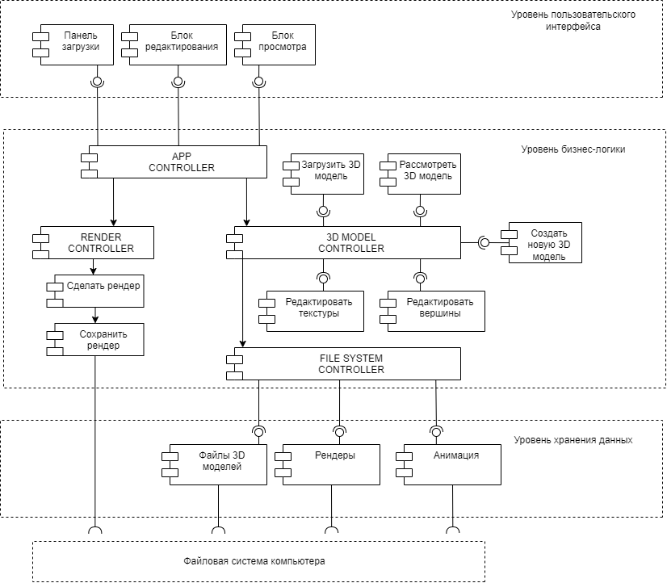

# Архитектура ПО (семинары)

## Урок 5. Горизонтальные уровни и вертикальные срезы архитектуры

1. Сформировать UML-диаграмму, отвечающей задаче: необходимо разделить на горизонтальные уровни «Редактор 3D графики”.  Один пользователь. Программа работает на одном компьютере без выхода в сеть. 
Что видит пользователь, как взаимодействует? (Панель загрузки, блок редактирования, блок просмотра …). 
Какие задачи можно делать – функции системы? (Загрузить 3D модель, рассмотреть 3D модель, создать новую, редактировать вершины, текстуры, сделать рендер, сохранить рендер… ). 
Какие и где хранятся данные? (файлы 3D моделей, рендеры, анимация .., в файловой системе компьютера). 
Предложить варианты связывания всех уровней – сценарии использования. 3-4 сценария. Сквозная функция – создать новую 3D модель, сделать рендер для печати на принтере…
   
2. Реализовать архитектуру из приложенной UML-диаграммы к уроку:

   
Где: 
   GUI - интерфейс отображения карты маршрута(поездки) 
   UX - интерфейс взаимодействия пользователя с системой
   AppController - контроллер приложения 
   GPS-sensor - пространственное положение пользователя в системе координат GPS 
   MapController - отвечает за карты 
   TripController - маршрут(поездка) 
   NetController - отвечает за связь с сетью 
   TripHistory - история маршрутов(поездок) пользователя 
   CityObjectsRepository - база данных населенных пунктов 
   RoadsRepository - база данных улиц 
   CurrentTrafficRepository - информация о текущей ситуации(пробки, знаки) 
   CamerasRepository - база данных камер ГИБДД
