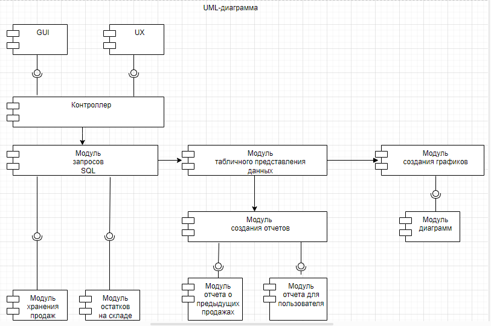
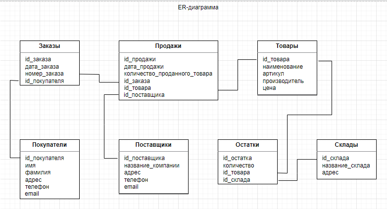

# Архитектура ПО (семинары)

## Урок 7. Типы архитектур WEB-приложений: MPA, SPA.

Продолжить упражнение с семинара (UML-диаграмма): 
 

Выпустить диаграмму компонент в нотации ER по приложенной UML:

