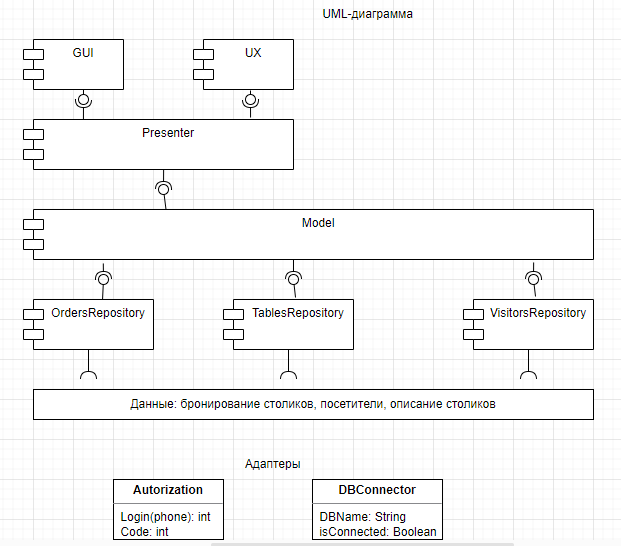
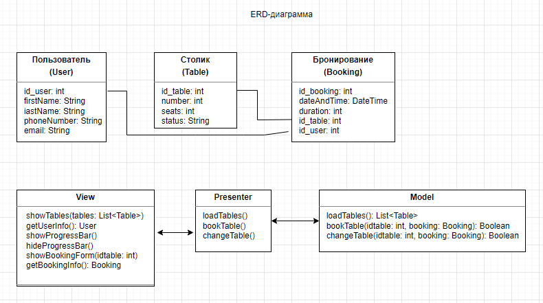

# Архитектура ПО (семинары)

## Урок 8. Типы архитектур прикладных приложений (мобильные): MVC, MVP, MVVM.
 
**<u>Задание:</u>** разработать полную ERD-диаграмму. 
Необходимо спроектировать сервис бронирования столика в ресторане. C полями ввода данных о пользователе и заказе, возможностью выбора столика и с кнопкой подтверждения заказа. 

