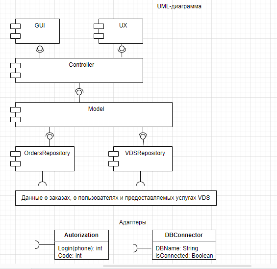
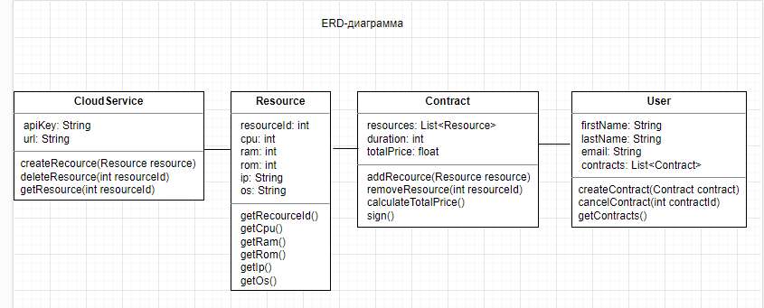

# Архитектура ПО (семинары)

## Урок 9. Способы организации передачи данных между компонентами приложения, протоколы и API. REST, gRPC, очереди

**<u>Задание:</u>** Разработать полную ERD-диаграмму домена, по UML-диаграмме из урока.
То есть создать модель для проектирования контракта API для приложения заказа (создания ресурсов) в облачном сервисе:
1. выделение количества ядер процессора
2. выделение объема оперативной памяти
3. выделение объема жесткого диска
4. выделение IP-адреса ресурса
5. выбор операционной системы 
    
   

